#  Term_II_Impact_Echo 

 
##    **Description**
######  A Digital Exploration 

   
* * A method for nondestructive testing of concrete and masonry structures that is based on the use of impact-generated stress (sound) waves that propagate through concrete and masonry and are reflected by internal flaws and external surfaces. 

##    Index 

   ###### -Proposal

   ###### -Non destructive testing

   ###### -Impact Echo Method

   ###### -Overall System
            -Diagram
            -Possible evolutions
            -Focus points

   ###### -Hardware
            -Diagram
            -Piezo sensor configuration

   ###### -Software
            -Diagram
            -Outcome

##    Project_Scope

* * The goal of this study was to develop an impact-echo device that can conduct automatic oscillation tests, process signals rapidly, and apply it to concrete object anomaly analysis. The system presented in this study comprises three parts, namely the impact device, the oscillator circuit, and signal processing software.

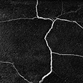

##  **Problem outline**

######   Possible applications

      
 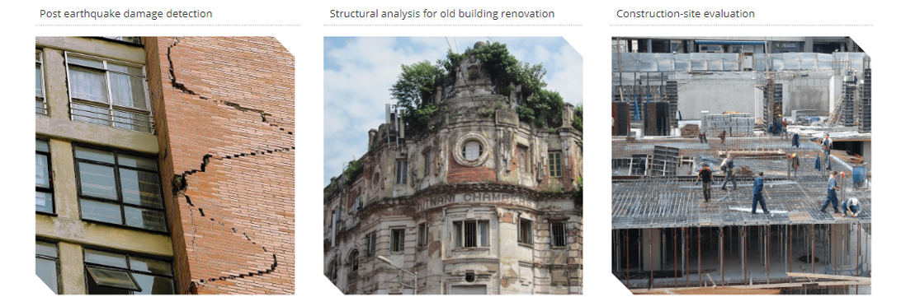
 ###### Structural analysis for old building renovation
 
 

##    **Nondestructive testing**

######  Methods

### Impact echo
###### Impact Echo is a method for nondestructive evaluation of concrete and masonry. It is based on the use of impact-generated compression waves that travel through the structure and are reflected by internal flaws and external surfaces.
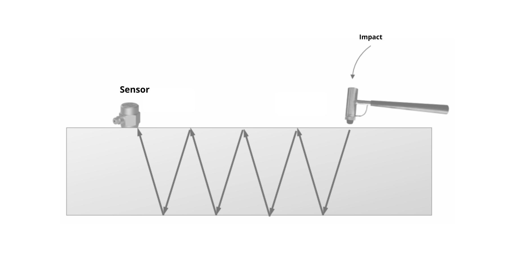
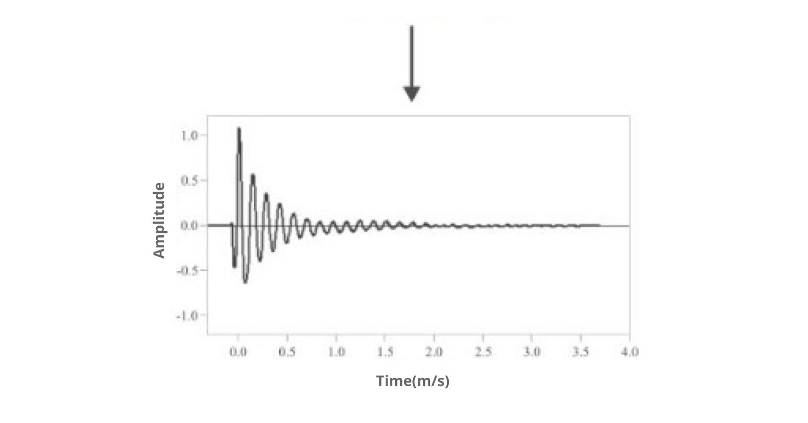
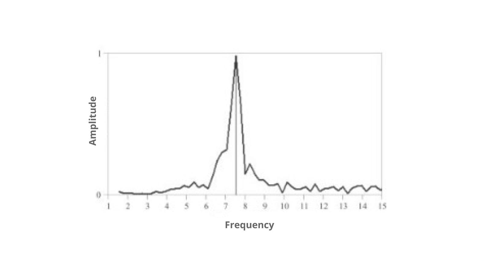

###                     Advantages & Applications

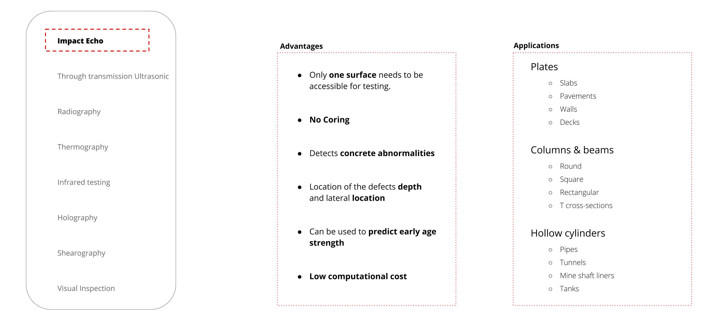

 
###                     Detection
####               Concrete Possible anomalies

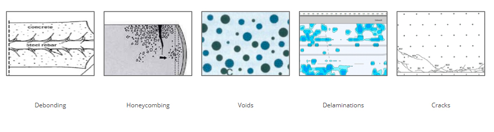

###                     Overall System
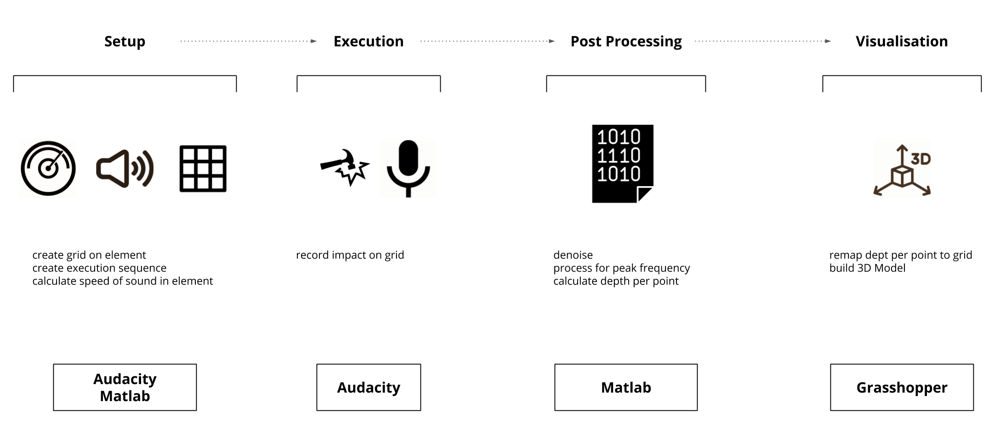

## **Requirements**

* [Arduino Uno](https://www.amazon.es/Longruner-Tarjeta-Expansi%C3%B3n-Controlador-LK75/dp/B072N4FMRN/ref=sr_1_8?__mk_es_ES=%C3%85M%C3%85%C5%BD%C3%95%C3%91&keywords=grbl&qid=1573215919&sr=8-8&th=1)

* [Piezoelectric sensor ](https://es.rs-online.com/web/p/componentes-de-piezo-buzzer/7474691?cm_mmc=ES-PLA-DS3A-_-google-_-CSS_ES_ES_Componentes_Pasivos-_-Avisadores_Ac%C3%BAsticos_And_Zumbadores_Y_Micr%C3%B3fonos-_-PRODUCT_GROUP&matchtype=&pla-438727075088&&cm_mmc=ES-PLA-_-google-_-XXX_CSS_ES_ES_Componentes_Pasivos-_-Avisadores_Ac%C3%BAsticos_And_Zumbadores_Y_Micr%C3%B3fonos&mkwid=s_dc%7cpcrid%7c397649826388%7cpkw%7c%7cpmt%7c%7cprd%7c7474691&lid=92700049816095795&ds_s_kwgid=58700005447578408&ds_e_product_group_id=438727075088&ds_e_product_store_id=&ds_e_ad_type=pla&ds_s_inventory_feed_id=97700000007471347&gclid=Cj0KCQjw9ZzzBRCKARIsANwXaeLfzyVIcDwIsl4ETDfD9TYQMEL887nJlDW_8vLoKCga47SuXjaDHdwaAlckEALw_wcB&gclsrc=aw.ds)

* [Bestep JQC3F03VDC-C Relay wiring ](https://www.banggood.com/BESTEP-1-Channel-3_3V-Low-Level-Trigger-Relay-Module-Optocoupler-Isolation-Terminal-p-1355736.html)

* [Solenoide lineal JF-0530B DC 6V](https://es.aliexpress.com/item/32777233179.html?src=google&src=google&albch=shopping&acnt=494-037-6276&isdl=y&slnk=&plac=&mtctp=&albbt=Google_7_shopping&aff_platform=google&aff_short_key=UneMJZVf&&albagn=888888&albcp=2047572441&albag=80829465588&trgt=743612850714&crea=es32777233179&netw=u&device=c&gclid=Cj0KCQjw9ZzzBRCKARIsANwXaeJAHvqxwToeQxN1fF6SR_idYwqZ86CJYnfg62FfIt5rNuWJnqDRZcwaAmQmEALw_wcB&gclsrc=aw.ds)

* [Preamp HiLetgo 5pcs LM38](https://www.amazon.es/HiLetgo-LM386-Amplificador-unidades-Raspberry/dp/B0797DK2G1/ref=sr_1_3?__mk_es_ES=%C3%85M%C3%85%C5%BD%C3%95%C3%91&keywords=LM386&qid=1580224629&s=industrial&sr=1-3)

* [TRS  Audio Cable](https://www.thomann.de/es/cae_audiokabel_30.htm?glp=1&gclid=EAIaIQobChMI1uv817CS6AIVmYbVCh35Ywb4EAQYASABEgI4DvD_BwE)

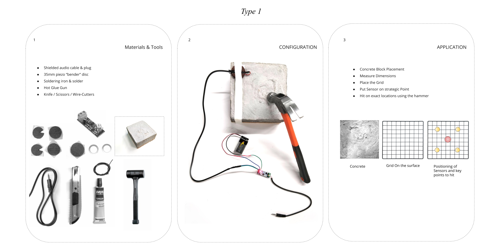

###                    Setup
####              
#### Measure Dimensions 
#### Generate the Grid		
#### Put Sensor on strategic Point
#### Hit on exact locations using the Solonoid

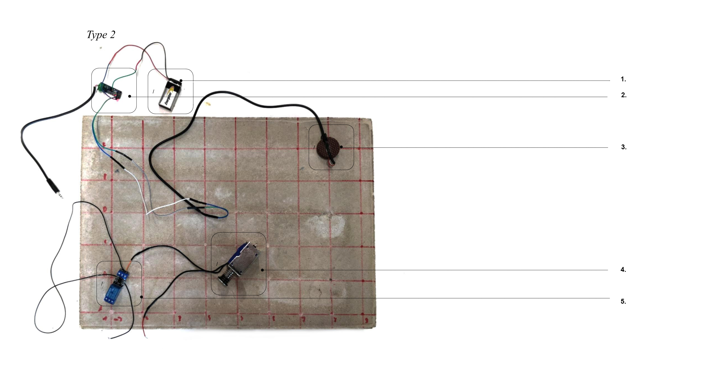
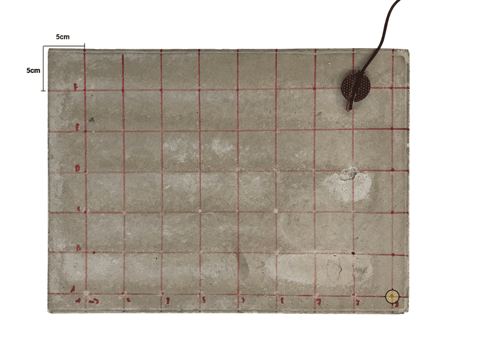

## Software

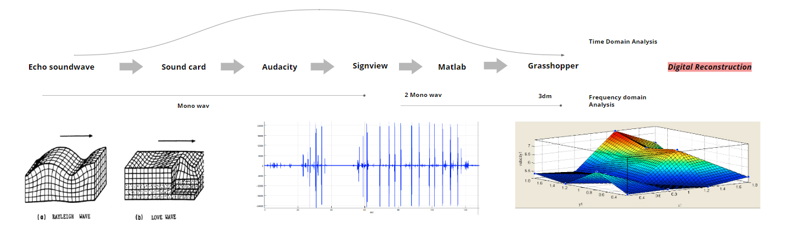

## Audacity
###### Recording Generation & First Visualisation 
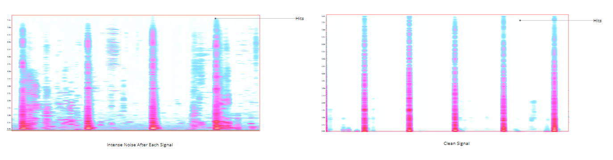

######   Denoising Recording

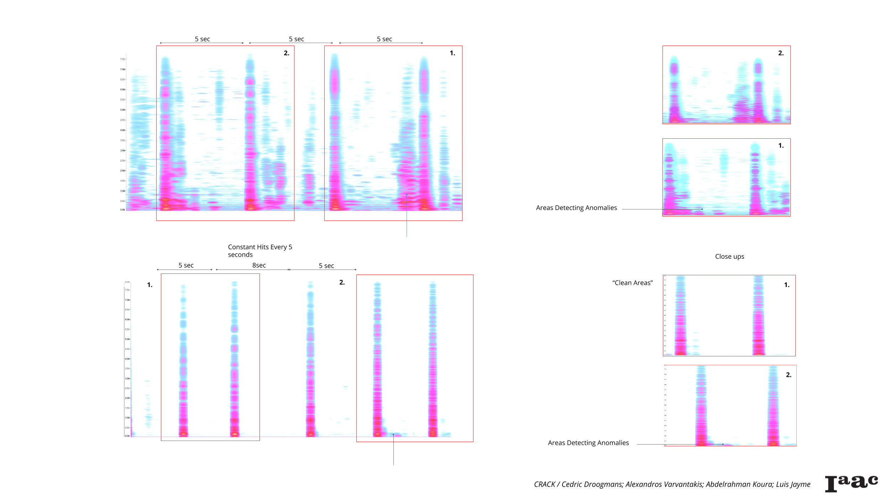

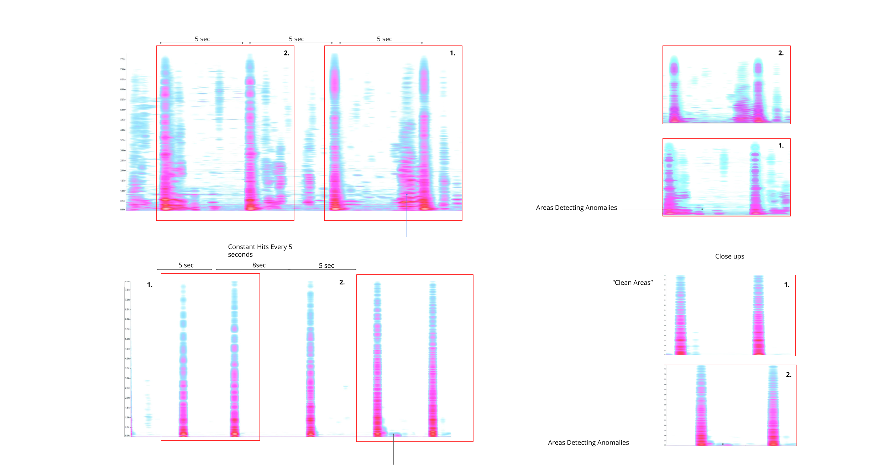

######   Identifying Anomalies

###### * [Audacity](https://github.com/alx6000/Term_II_Impact_Echo/tree/master/Audacity)

## Signview

###### 3d Spectrogram 
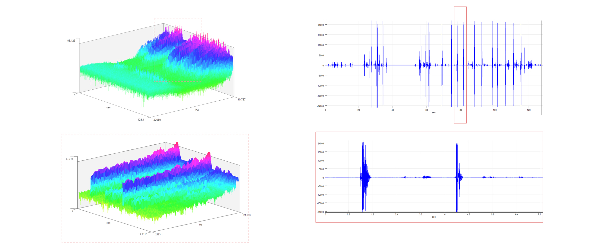
######  Spectrogram - Visual representation of the spectrum of frequencies of a signal as it varies with time. 

###### * [SignView](https://github.com/alx6000/Term_II_Impact_Echo/tree/master/SignView)

## Matlab
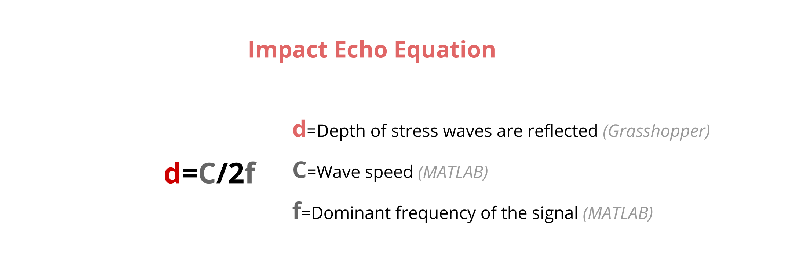

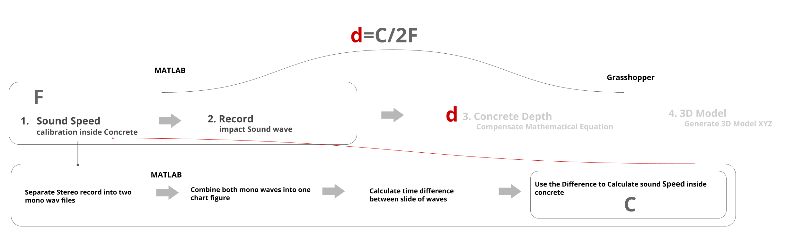
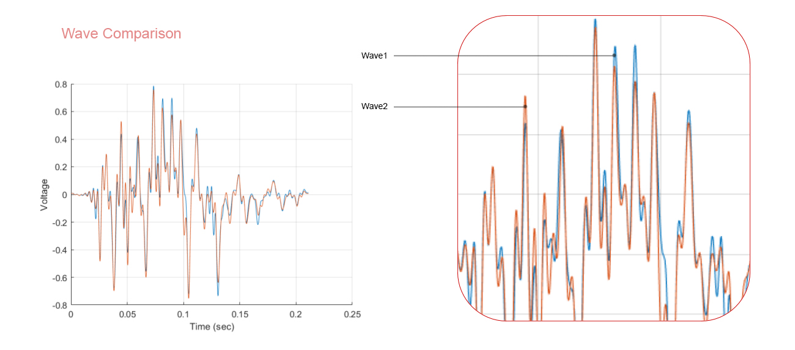

###### * [MATLAB](https://github.com/alx6000/Term_II_Impact_Echo/tree/master/SignView)

## Grasshopper
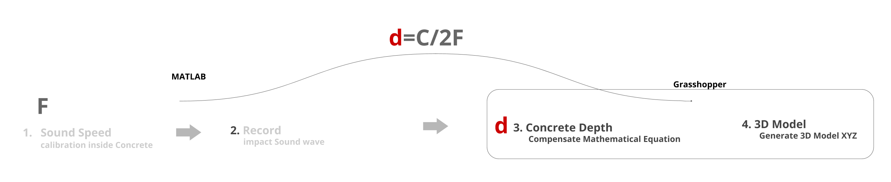

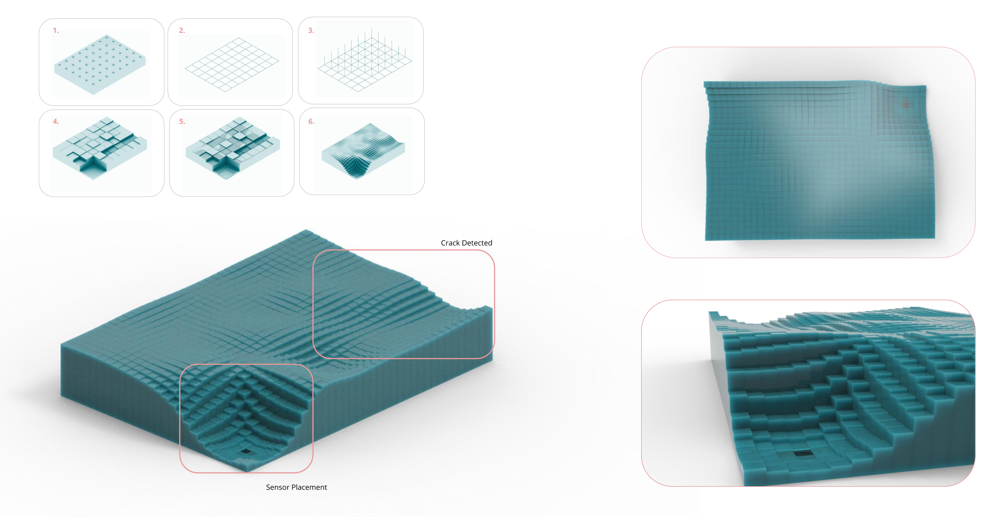

## Alternative Visualisation - Python
###### Experimentation - Visualisation

###### Tangible Python Library Experimentation

######  Tangible is a modular Library system with an intermediate representation of objects for soundwave 3d representation.

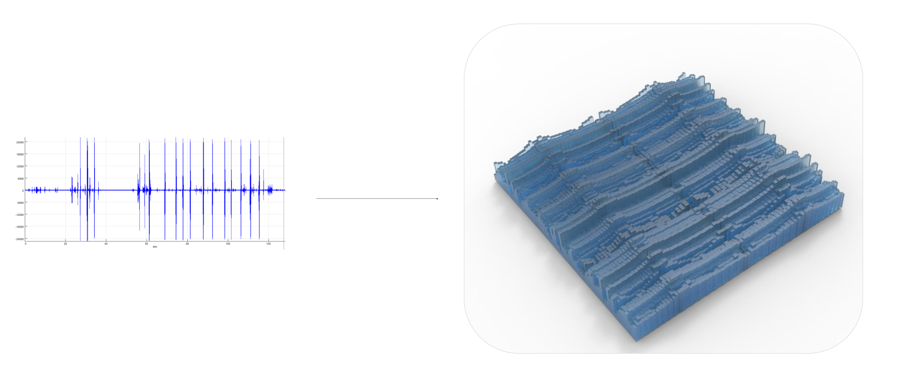

###### 02

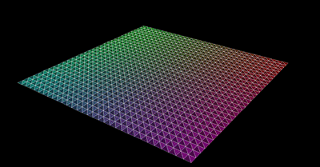

