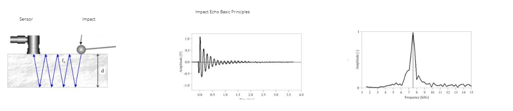
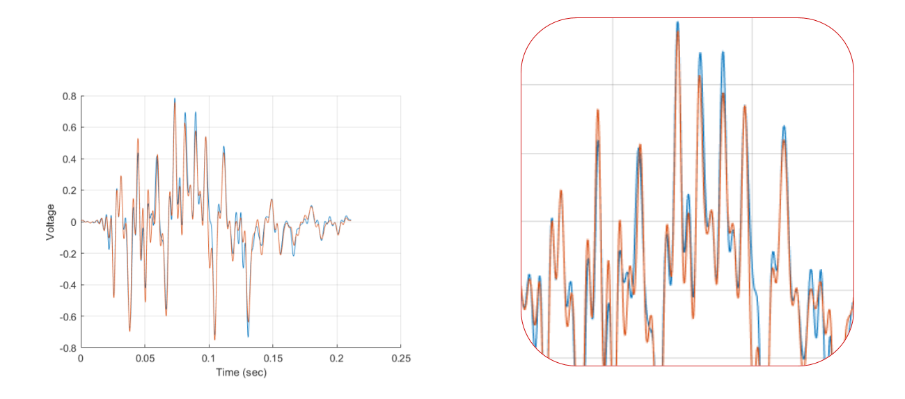
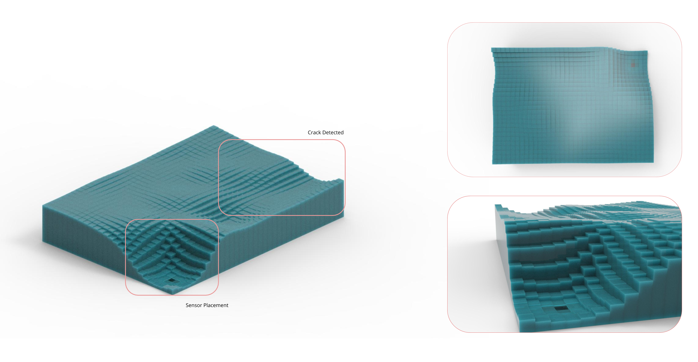

#  Term_II_Impact_Echo 

 
##    **Description**
######  A Digital Exploration 

   
* * A method for nondestructive testing of concrete and masonry structures that is based on the use of impact-generated stress (sound) waves that propagate through concrete and masonry and are reflected by internal flaws and external surfaces. 


##    Index 

   ###### -Proposal

   ###### -Non destructive testing

   ###### -Impact Echo Method

   ###### -Overall System
            -Diagram
            -Possible evolutions
            -Focus points

   ###### -Hardware
            -Diagram
            -Piezo sensor configuration

   ###### -Software
            -Diagram
            -Outcome


##    Project_Scope

* * The goal of this study was to develop an impact-echo device that can conduct automatic oscillation tests, process signals rapidly, and apply it to concrete object anomaly analysis. The system presented in this study comprises three parts, namely the impact device, the oscillator circuit, and signal processing software.


##  **Problem outline**

######   Possible applications


      
 
 ###### Structural analysis for old building renovation
 
 


##    **Nondestructive testing**

######  Methods


### Impact echo
###### Impact Echo is a method for nondestructive evaluation of concrete and masonry. It is based on the use of impact-generated compression waves that travel through the structure and are reflected by internal flaws and external surfaces.



###                     Advantages & Applications


 
###                     Detection
####               Concrete Possible anomalies


###                     Application
####              Grid Setup - Positioning Piezosensors & Selonoid
#### Concrete Block Placement
#### Measure Dimensions 
#### Place the Grid		
#### Put Sensor on strategic Point
#### Hit on exact locations using the hammer


## Software


## Audacity
###### Recording Generation & First Visualisation 


######   Denoising Recording


######   Identifying Anomalies


###### * [Audacity](https://github.com/alx6000/Term_II_Impact_Echo/tree/master/Audacity)

## Signview

###### 3d Spectrogram 

######  Spectrogram - Visual representation of the spectrum of frequencies of a signal as it varies with time. 

###### * [SignView](https://github.com/alx6000/Term_II_Impact_Echo/tree/master/SignView)

## Matlab



###### * [MATLAB](https://github.com/alx6000/Term_II_Impact_Echo/tree/master/SignView)

## Grasshopper





## Python
###### Experimentation - Visualisation

###### Usage
```python
import numpy as np
from opensimplex import OpenSimplex
import pyqtgraph.opengl as gl
from pyqtgraph.Qt import QtCore, QtGui
import struct
import pyaudio
import sys
inPath = ''
outPath = ''

class Terrain(object):
    def __init__(self):
        """
        Initialize the graphics window and mesh surface
        """

        # setup the view window
        self.app = QtGui.QApplication(sys.argv)
        self.window = gl.GLViewWidget()
        self.window.setWindowTitle('Terrain')
        self.window.setGeometry(0, 110, 1920, 1080)
        self.window.setCameraPosition(distance=30, elevation=12)
        self.window.show()

        # constants and arrays
        self.nsteps = 1.3
        self.offset = 0
        self.ypoints = np.arange(-20, 20 + self.nsteps, self.nsteps)
        self.xpoints = np.arange(-20, 20 + self.nsteps, self.nsteps)
        self.nfaces = len(self.ypoints)

        self.RATE = 44100
        self.CHUNK = len(self.xpoints) * len(self.ypoints)

        self.p = pyaudio.PyAudio()
        self.stream = self.p.open(
            format=pyaudio.paInt16,
            channels=1,
            rate=self.RATE,
            input=True,
            output=True,
            frames_per_buffer=self.CHUNK,
        )

        # perlin noise object
        self.noise = OpenSimplex()

        # create the veritices array
        verts, faces, colors = self.mesh()
        
        
        

        self.mesh1 = gl.GLMeshItem(
            faces=faces,
            vertexes=verts,
            faceColors=colors,
            drawEdges=True,
            smooth=False,
        )
        self.mesh1.setGLOptions('additive')
        self.window.addItem(self.mesh1)

    def mesh(self, offset=0, height=2.5, wf_data=None):

        if wf_data is not None:
            wf_data = struct.unpack(str(2 * self.CHUNK) + 'B', wf_data)
            wf_data = np.array(wf_data, dtype='b')[::2] + 128
            wf_data = np.array(wf_data, dtype='int32') - 128
            wf_data = wf_data * 0.04
            wf_data = wf_data.reshape((len(self.xpoints), len(self.ypoints)))
        else:
            wf_data = np.array([1] * 1024)
            wf_data = wf_data.reshape((len(self.xpoints), len(self.ypoints)))

        faces = []
        colors = []
        verts = np.array([
            [
                x, y, wf_data[xid][yid] * self.noise.noise2d(x=xid / 5 + offset, y=yid / 5 + offset)
            ] for xid, x in enumerate(self.xpoints) for yid, y in enumerate(self.ypoints)
        ], dtype=np.float32)

        for yid in range(self.nfaces - 1):
            yoff = yid * self.nfaces
            for xid in range(self.nfaces - 1):
                faces.append([
                    xid + yoff,
                    xid + yoff + self.nfaces,
                    xid + yoff + self.nfaces + 1,
                ])
                faces.append([
                    xid + yoff,
                    xid + yoff + 1,
                    xid + yoff + self.nfaces + 1,
                ])
                colors.append([
                    xid / self.nfaces, 1 - xid / self.nfaces, yid / self.nfaces, 0.3
                ])
                colors.append([
                    xid / self.nfaces, 1 - xid / self.nfaces, yid / self.nfaces, 0.5
                ])

        faces = np.array(faces, dtype=np.uint32)
        colors = np.array(colors, dtype=np.float32)

        return verts, faces, colors

    def update(self):
        """
        update the mesh and shift the noise each time
        """

        wf_data = self.stream.read(self.CHUNK)

        verts, faces, colors = self.mesh(offset=self.offset, wf_data=wf_data)
        self.mesh1.setMeshData(vertexes=verts, faces=faces, faceColors=colors)
        self.offset -= 0.05

    def start(self):
        """
        get the graphics window open and setup
        """
        if (sys.flags.interactive != 1) or not hasattr(QtCore, 'PYQT_VERSION'):
            QtGui.QApplication.instance().exec_()

    def animation(self, frametime=10):
        """
        calls the update method to run in a loop
        """
        timer = QtCore.QTimer()
        timer.timeout.connect(self.update)
        timer.start(frametime)
        self.start()


if __name__ == '__main__':
    t = Terrain()
    t.animation()
```


###### Tangible Python Library Experimentation


######  Usage

```python
from math import log
import matplotlib.mlab as mlab
import numpy
from tangible import ast, scales
from tangible.backends.openscad import OpenScadBackend
from tangible.shapes.bars import BarsND
import wave
import nfft

inPath = ""
outPath = ""

loggishness = 0.00000000000004

nfft = 2**18
padto = nfft/(2**13)

padto = int (padto)

def main():

  print ("Reading and analyzing file...")
  spectrum, freqs = ReadAndAnalyze(inPath)

  print (len(freqs))
  print (len(spectrum[0]))


  print ("Scaling logarithmically (kinda)...")
  for i, s in enumerate(spectrum):
    spectrum[i] = list(map(loggish, s))

  print ("Generating linear scale...")
  scale = scales.linear(domain=[spectrum.min(), spectrum.max()],
                        codomain=[1, 10])

  print ("Normalizing spectrum data...")
  datapoints = list(map(lambda x:list(map(scale, x)), spectrum))

  print ("Trimming spectrum data post-normalization...")
  for i, x in enumerate(datapoints):
    for j, v in enumerate(x):
        if v > 9:
          datapoints[i][j] = 9

  print ("Generating bars...")
  bars = BarsND(datapoints,
                bar_width=1,
                bar_depth=1)

  print ("Rendering...")
  code = bars.render(backend=OpenScadBackend)

  print ("Saving to file...")
  with open(outPath, "w") as f:
      f.write(code)

def loggish(v):
  v = float(v)
  L = loggishness
  return L * (log(v) - v) + v

def ReadAndAnalyze(f):
    wav = wave.open(f, 'r')
    frames = wav.readframes(-1)
    sound_info = numpy.fromstring(frames, 'Int16')
    frame_rate = wav.getframerate()
    wav.close()
    specdata = mlab.specgram(sound_info,
                             NFFT=nfft,
                             pad_to=padto,
                             Fs=frame_rate)
    spectrum = specdata[0]
    freqs = specdata[1]
    return spectrum, freqs

if __name__ == "__main__":
  main()
```  


## **Requirements**

* [Arduino Uno](https://www.amazon.es/Longruner-Tarjeta-Expansi%C3%B3n-Controlador-LK75/dp/B072N4FMRN/ref=sr_1_8?__mk_es_ES=%C3%85M%C3%85%C5%BD%C3%95%C3%91&keywords=grbl&qid=1573215919&sr=8-8&th=1)

* [Piezoelectric sensor ](https://es.rs-online.com/web/p/componentes-de-piezo-buzzer/7474691?cm_mmc=ES-PLA-DS3A-_-google-_-CSS_ES_ES_Componentes_Pasivos-_-Avisadores_Ac%C3%BAsticos_And_Zumbadores_Y_Micr%C3%B3fonos-_-PRODUCT_GROUP&matchtype=&pla-438727075088&&cm_mmc=ES-PLA-_-google-_-XXX_CSS_ES_ES_Componentes_Pasivos-_-Avisadores_Ac%C3%BAsticos_And_Zumbadores_Y_Micr%C3%B3fonos&mkwid=s_dc%7cpcrid%7c397649826388%7cpkw%7c%7cpmt%7c%7cprd%7c7474691&lid=92700049816095795&ds_s_kwgid=58700005447578408&ds_e_product_group_id=438727075088&ds_e_product_store_id=&ds_e_ad_type=pla&ds_s_inventory_feed_id=97700000007471347&gclid=Cj0KCQjw9ZzzBRCKARIsANwXaeLfzyVIcDwIsl4ETDfD9TYQMEL887nJlDW_8vLoKCga47SuXjaDHdwaAlckEALw_wcB&gclsrc=aw.ds)

* [Bestep JQC3F03VDC-C Relay wiring ](https://www.banggood.com/BESTEP-1-Channel-3_3V-Low-Level-Trigger-Relay-Module-Optocoupler-Isolation-Terminal-p-1355736.html)

* [Solenoide lineal JF-0530B DC 6V](https://es.aliexpress.com/item/32777233179.html?src=google&src=google&albch=shopping&acnt=494-037-6276&isdl=y&slnk=&plac=&mtctp=&albbt=Google_7_shopping&aff_platform=google&aff_short_key=UneMJZVf&&albagn=888888&albcp=2047572441&albag=80829465588&trgt=743612850714&crea=es32777233179&netw=u&device=c&gclid=Cj0KCQjw9ZzzBRCKARIsANwXaeJAHvqxwToeQxN1fF6SR_idYwqZ86CJYnfg62FfIt5rNuWJnqDRZcwaAmQmEALw_wcB&gclsrc=aw.ds)


